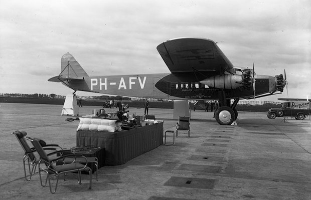
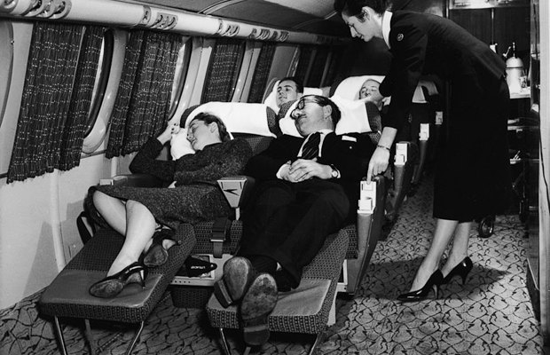
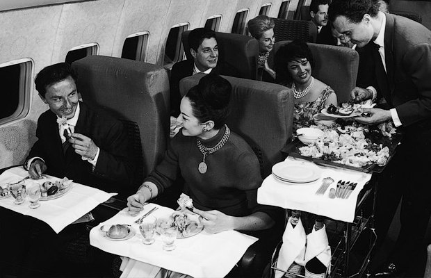

# How aircraft interiors have become cheap and tight

The interior of passenger planes was not always like this. Aircraft manufacturers are moving from luxury to maximum economy: Airbus recently told that they plan to accommodate up to 11 people in one row. We have seen how the airliner salons have changed in a century.

- 1920-е:
- bands and curtains

Although passenger flights were occasionally operated already in the 1910s, they became regular flights a decade later. Travel by air was expensive and tiresome, and therefore airlines tried to make their salons as comfortable as possible. Planes were biplane, and they were often called "air limousines". The interior rooms were small: to the right and left of the aisle were placed only one chair, but they were as comfortable as possible, often covered with leather. However, in some cases, they could be straw. Illuminators were closed by ordinary curtains. Luggage was placed on open shelves above the heads of passengers. According to the photos, already in the 1920s, during the flight, films were shown to entertain passengers. In this case, the passengers could be accompanied by a taper.
 
- 1930s and 1940s:
- beds and sofas

In the 1930s, the biplane was replaced by the usual monoplanes, and they were made of metal rather than wood. This was due not only to aerodynamic properties, but also to the expansion of the flight geography: in regions with high temperature and humidity, wood quickly deteriorated. These changes allowed expanding the salons and filling them with furniture. The airline's clients were still rich people, during the flight the cabin still smelled unpleasant and was unbearably noisy, and passengers tried their best to distract from it. In addition, the flights could last for several days (with stops on the way). In addition to the usual cabin with rows of chairs and sofas, between which there were tables, the plane had a room for sleep, similar to a coupe in the train. Such airliners flew on long distances and could carry no more than 20 people.
 
- 1950s and 1960s:
- postcards and cigarettes

In the USA 1950-1960s is called the "golden age" of passenger aviation. The flights were still expensive at that time, but the interiors of the planes already looked like modern ones. Illuminators took the usual form, almost all seats looked forward, but each passenger had enough room for his feet. At night the seats were unfolded and turned into beds, and stewardesses (whose appearance was very strict requirements) brought pillows and blankets to passengers. Luxurious food was served for lunch: lobsters were considered to be quite an acceptable dish for a flight. However, besides food and magazines, there was nothing to entertain passengers. There were no radio and TV screens in the salons, and customers were engaged in writing letters. Each passenger was given a card with the image of the plane or some dish, which is served on board. In the text of the letter it was accepted to describe the feelings from the flight. And Air France hired artists, who painted pictures for the interior of the aircraft. Among other things, smoking was allowed in the cabin of the airliner, unlike at airports, where they were afraid of possible contact between fire and fuel.
